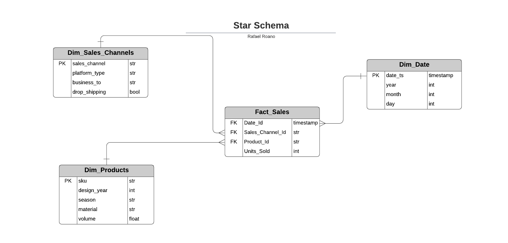
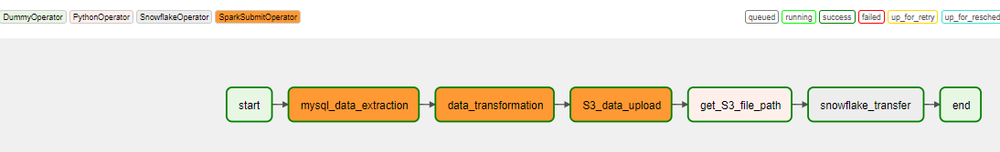

# Data Pipeline Project

This project is an implementation of a data pipeline that extracts daily sales transactions from a Transactional Database (OLTP) and performs the required transformations to generate ready-to-analyze data and store it into a Data Warehouse (OLAP). The processed data can be used to evaluate different metrics, including the success of each product in different marketplaces in a particular time period. These metrics facilitate the decision-making process in business areas such as Inventory Control and New Product Development.

The project includes two versions:

* Local Processing: Data transformation is performed locally (ETL Pipeline)

* Distributed Processing: Data transformation is performed using cloud resources (ELT Pipeline)

<!-- TABLE OF CONTENTS -->
## Table of Contents

* [Architecture Diagrams](#Architecture-Diagrams-and-Technologies)
* [Entity Relationship Diagrams](#Entity-Relationship-Diagrams)
* [Setup](#Setup)
* [DAGS](#DAGS)
* [Pipeline Steps](#Pipeline-Steps)

<!-- ARCHITECTURE DIAGRAMS -->
## Architecture Diagrams and Technologies


* Apache Airflow: Open-source workflow management platform, used to orchestrate and schedule pipeline tasks. Airflow was selected for this project for having plenty of operators and plugins right out of the box and for its robust workflow monitoring capability. It has a large community as well.

* Apache Spark: Open-source framework for large-scale data processing. Spark was selected as processing framework for being language-flexible and easy to scale when required, from single-node to clusters. It also has large community support.

* Snowflake: Cloud computing-based data warehouse that enables data storage and analytic solutions. Snowflake was selected as a dedicated database for cleaned historical data, based on a cost-benefit analysis, which considered the size of the workloads at this stage, but also the benefit of having a data warehouse/dashboard single ecosystem.

* S3: AWS cloud storage service for loading of the transformed data (Fact and Dimension tables) into Snowflake tables.

* Influxdb Cloud: Cloud system for metrics and infrastructure monitoring.

* EMR: AWS managed cluster platform to run big data frameworks (Apache Spark, Apache Hadoop, etc.). Only required in this project for the Distributed Processing version (cluster mode).

* Docker: Open-source containerization platform, used in the project to simplify the handling of libraries and dependencies.

<!-- ENTITY RELATIONSHIP DIAGRAMS -->
## Entity-Relationship Diagrams

### Source Schema (OLTP)


### Star Schema (OLAP)



<!-- Setup -->
## Setup

### Clone project

```bash
git clone https://github.com/rafael-roano/Open-ended_Capstone.git
```

### Build Docker Image

Navigate to Open-ended_Capstone/docker/docker-airflow and build Docker image to set up an Airflow/Spark environment:

```bash
docker build --rm --force-rm -t docker-af-sp-hd:2.1.0_3.1.2_2.7 . --build-arg AIRFLOW_VERSION=2.1.0 --build-arg SPARK_VERSION=3.1.2 --build-arg HADOOP_VERSION=2.7
```

This image includes:

* Airflow 2.1.0
* Spark 3.1.2
* Hadoop 2.7

The following dependencies are included via the *requirements.txt*:

* apache-airflow-providers-apache-spark 2.0.1
* apache-airflow-providers-snowflake 2.1.1
* apache-airflow-providers-amazon 2.2.0

### Start Containers

Navigate to Open-ended_Capstone/docker to create and start containers:

```bash
docker-compose -f docker-compose-2.1.0_3.1.2_2.7.yml up 
```

The previous command will create the following containers:

| Container Name    | Image                           |
| ----------------- | ------------------------------- |
| postgres          | postgres:9.6                    |
| airflow-webserver | docker-af-sp-hd:2.1.0_3.1.2_2.7 |
| spark-master      | bitnami/spark:3.1.2             |
| spark-worker-1    | bitnami/spark:3.1.2             |

### Airflow Connections

The following connections setup is required:

#### Spark

| Field                 | Value                           |
| --------------------- | ------------------------------- |
| Conn Id               | spark_default                   |
| Conn Type             | Spark                           |
| Host                  | spark://spark                   |
| Port                  | 7077                            |

#### Snowflake

| Field                 | Value                                        |
| --------------------- | -------------------------------------------- |
| Conn Id               | snowflake                                    |
| Conn Type             | Snowflake                                    |
| Host                  | https://<snowflake account>.snowflakecomputing.com/    |
| Schema                | STAR_SCHEMA                                  |
| Login                 | snowflake username                           |
| Password              | snowflake password                           |
| Extra                 | {"extra__snowflake__account": "<snowflake account>", "extra__snowflake__aws_access_key_id": "", "extra__snowflake__aws_secret_access_key": "", "extra__snowflake__database": "SALES", "extra__snowflake__region": "", "extra__snowflake__role": "", "extra__snowflake__warehouse": "COMPUTE_WH"}                           |
| Account               | snowflake account                            |
| Database              | SALES                                        |
| Region                | us-west-2                                    |
| Warehouse             | COMPUTE_WH                                   |

#### S3

| Field                 | Value                           |
| --------------------- | ------------------------------- |
| Conn Id               | s3                              |
| Conn Type             | S3                              |
| Extra                 | {"aws_access_key_id":"", "aws_secret_access_key": "", "region_name": ""} |

<!-- DAGS -->

## DAGS

Airflow DAGS included are:

* initial_etl_dag.py: Runs the ETL steps required to populate our model at the time of setup.


* pipeline_dag.py: Runs the ETL steps required to add the incremental data to our model on a daily basis.



* initial_etl_dag_aws.py: Runs the ETL steps required to populate our model at the time of setup for the cluster mode.


* pipeline_dag_aws.py: Runs the ETL steps required to add the incremental data to our model on a daily basis for the cluster mode.


### Set up and activate DAGS

Steps to start the pipeline are:

#### Initial ETL Run

1. Adjust *start_date* and *finish_date* in module **initial_data_extraction.py** (or **initial_data_extraction_aws.py** if using cluster mode) with any required date range to load the model before activating the daily ETL.

2. Activate *initial_etl_dag* on Airflow UI (or *initial_etl_dag_aws* if using cluster mode).

3. Triger *initial_etl_dag* manually.

#### Daily ETL Runs

1. Once an initial load was performed successfully, adjust *start_date* in modules **pipeline_dag.py** (or **pipeline_dag_aws.py**) with the previous day's date.

2. Activate *pipeline_dag* on Airflow UI (or *pipeline_dag_aws* if using cluster mode)

<!-- PIPELINE STEPS -->
## Pipeline Steps

### Extraction

Sales transactional data is generated on a daily basis by a Sales and Inventory management system which is built on top of a MySQL database. This database is hosted locally on a tower server. Extraction consists of 2 modules:

* initial_data_extraction.py: Extracts specific tables from the MySQL database, required to build the Star Schema in the Transformation step. The tables extracted are:

  * so:       Sales orders at total level.
  * soitem:   Individual items included on sales orders.
  * product:  Products (items displayed on the sales orders) and their attributes.
  * part:     Parts and their attributes. A part can be sold as different product numbers, so we are interested in using parts as part of the grain for our Star Schema definition.

The initial data extraction module considers a specific date range for the sales transactions to populate our model at the time of setup; looking to load the system with all the required historical transactions, before starting the daily extraction for future sales.

It also extracts the product and the part tables, required to build both the Fact Table and the Product Dimension table.

The module reduces the tables to include only those fields that are required to build our model. The tables are saved locally into Parquet files.

* daily_data_extraction.py: Extracts tables *so* and *soitem* on a daily basis for the previous day. Since tables *product* and *part* were already extracted and reduced in the initial data extraction module, there is no need to get them every day.

### Transformation

Tables extracted in the previous step are read locally and transformed into the Star Schema. Transformation consists of 2 modules:

* initial_data_cleaning.py: Performs required transformations to build the Fact and Dimension tables for the initial load. Transformations include:

  * *so* table:

    * Sales orders with status not required are filtered out (80: Voided, 85: Cancelled, 90: Expired, 95: Historical)
    * Sales orders are categorized by Sales Channels.
    * Uncategorized orders or categories not required are removed.

  * *soitem* table:

    * Only items that are sales items are selected. Other types of items are not required (e.g. shipping, discounts, etc.).
    * Quantity ordered is rounded with no decimal digits.

  * *part* table:

    * Part attributes such as design year, season and material are extracted from json column into new columns.
    * Part volume is calculated.

  * *Fact_Sales* table is created by joining:

    * *soitem* table with *so* table = *categorized_items* table.
    * *categorized_items* table with *product* table.
    * *categorized_items* table with *part* table.

  * *Dim_Products* table is created by selecting only the required fields from *part* table, such as design year, season, material, etc.

  * *Dim_Sales_Channels* table is read from a CSV file that contains information about the different sales channel categories, such as name, platform type, etc.

  * *Dim_Dates* table is read from a CSV file that contains dates in timestamp format, plus columns with day, month and year for 2021.

The module saves locally the Star Schema tables as Parquet files. It also saves those transactions that were filtered out (uncategorized and other no relevant categories) into a CSV file as backup.

* daily_data_extraction.py: Performs same transformations as the previous module, but only for tables *so* and *soitem*, for the incremental data, extracted on a daily basis.

### Loading

Tables transformed in the previous step, resulting in the Fact and Dimension tables, are loaded to an S3 bucket, from where Snowflake is populated. Loading consists of 2 modules and multiple Airflow operators:

* initial_data_upload.py: Uploads the Fact and Dimension tables into an S3 bucket.

* daily_data_upload.py: Uploads the daily incremental data to add to the Fact table.

* get_S3_file_path operator: Python operator that gets S3 file paths for the Fact and Dimension tables by calling function *get_s3_paths*.

* fact_sales_snowflake_transfer operator: Snowflake operator that loads *Fact_Sales* table into Snowflake.

* dim_prod_snowflake_transfer operator: Snowflake operator that loads *Dim_Products* table into Snowflake. This operator is only included in the DAGS for the Initial ETL process.

* dim_chan_snowflake_transfer operator: Snowflake operator that loads *Dim_Sales_Channels* table into Snowflake. This operator is only included in the DAGS for the Initial ETL process.

* dim_dates_snowflake_transfer operator: Snowflake operator that loads *Dim_Dates* table into Snowflake. This operator is only included in the DAGS for the Initial ETL process.

### Cluster mode

In order to use the Distributed Processing version, the following modules and Airflow operators are required:

* Modules are based on the previous modules, but adapted to work directly with S3 and an EMR cluster:

  * initial_data_extraction_aws.py
  * initial_data_cleaning_aws.py
  * daily_data_extraction_aws.py
  * daily_data_cleaning_aws.py

* Operators:

  * cluster_steps_addition operator: EMR Add Steps Operator to the add spark-submit command as a step to the cluster, which submits the initial_data_cleaning_aws.py and daily_data_cleaning_aws.py modules to the cluster.
  * step_check sensor: EMR Step Sensor to wait to the step to complete before proceeding with the next DAG tasks.

## Authors

Rafael Roano
